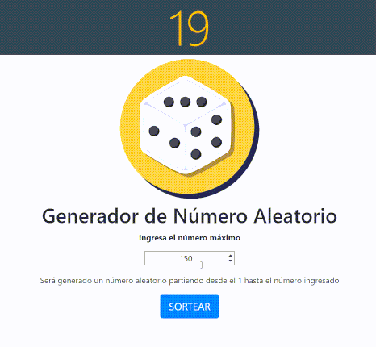

# Numero Aleatorio

Generador de número aleatorio, útil para rifas o juegos al azar, funciona como dado.
## Probar app :  https://johanjimenex.github.io/numero-aleatorio/

### Captura de pantalla




`Nota:`
He utilizado el framework de bootstrap.css para los estilos, recuerde vincular el mismo:
`Bootstrap.css`
```html
<link rel="stylesheet" href="bootstrap.css">
```

`html`
``` html
<!DOCTYPE html>
<html lang="es">

<head>
  <meta charset="UTF-8">
  <meta name="viewport" content="width=device-width, initial-scale=1.0">
  <meta http-equiv="X-UA-Compatible" content="ie=edge">
  <link rel="stylesheet" href="bootstrap.css">
  <title>Generador de número aleatorio</title>
</head>

<body>
  <div class="container-fluid text-center">

    <div id="contenedor" class="text-center display-1  bg-dark text-warning "></div>

    <div class="container-fluid ">
      <div class="container">

        

        <h1 class="display-5 ">Generador de Número   Aleatorio  </h1>
        <p class="font-weight-bold">Ingresa el número maximo</p>

        <input id="input" class="text-center border border-dark  " type="number" placeholder="ejemplo: 146" required>


        <hr class="my-2">
        <p>Será generado un número aleatorio partiendo desde el 1 hasta el numero ingresado</p>

        <button id="boton" class="btn btn-primary btn-lg display-1">SORTEAR</button>

      </div>
    </div>

  </div>

  <script src="javascript.js"></script>
</body>

</html>
```

`javascript`
``` javascript
var numeroIngresado = document.querySelector("#input");
var botonSortear = document.querySelector("#boton");
var contenedor = document.querySelector("#contenedor");

botonSortear.addEventListener("click", sortear);

function sortear(e) {
    e.preventDefault();

    //Muestra animacion del circulo cargando, las clases para la animacion de css son agregadas con bootstrap.css
    contenedor.innerHTML = '<div id="carga" class="mb-4 spinner-border text-warning display-1 " role="status"></div>';

    //Esta funtion crea un intervalo de tiempo, luego pasado 2 segundos ejecuta una accion
    setTimeout(() => {

        //Math.ceil() redondea un numero hacia arriba y Math.random() genera un numero aleatorio desde el 0 hasta el 1 ej: 0.54
        var numeroGanador = Math.ceil(Number(numeroIngresado.value) * Math.random());

        //Reemplaza el contenido (actualmente la animacion) por el numero generado aleatoriamente
        contenedor.innerHTML = numeroGanador;

    }, 2000);

}
```